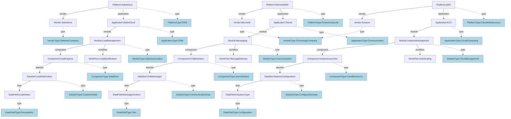

# Coreaa Instance Diagram

```mermaid
graph TD
%% Platforms
Salesforce[Platform:Salesforce]
Microsoft365[Platform:Microsoft365]
AWS[Platform:AWS]

%% Vendors
VendorSalesforce[Vendor:Salesforce]
VendorMicrosoft[Vendor:Microsoft]
VendorAmazon[Vendor:Amazon]

%% Applications
SalesCloud[Application:SalesCloud]
Teams[Application:Teams]
EC2[Application:EC2]

%% Modules
LeadManagement[Module:LeadManagement]
Messaging[Module:Messaging]
InstanceManagement[Module:InstanceManagement]

%% Components
LeadCapture[Component:LeadCapture]
ChatInterface[Component:ChatInterface]
InstanceLauncher[Component:InstanceLauncher]

%% DataSets
LeadInformation[DataSet:LeadInformation]
ChatMessages[DataSet:ChatMessages]
InstanceConfiguration[DataSet:InstanceConfiguration]

%% DataFields
LeadName[DataField:LeadName]
MessageContent[DataField:MessageContent]
InstanceType[DataField:InstanceType]

%% Platform relationships
Salesforce -->|vendor| VendorSalesforce
Salesforce -->|application| SalesCloud
Microsoft365 -->|vendor| VendorMicrosoft
Microsoft365 -->|application| Teams
AWS -->|vendor| VendorAmazon
AWS -->|application| EC2

%% Application relationships
SalesCloud -->|module| LeadManagement
Teams -->|module| Messaging
EC2 -->|module| InstanceManagement

%% Module relationships
LeadManagement -->|component| LeadCapture
LeadManagement -->|workflow| LeadQualification[WorkFlow:LeadQualification]
Messaging -->|component| ChatInterface
Messaging -->|workflow| MessageDelivery[WorkFlow:MessageDelivery]
InstanceManagement -->|component| InstanceLauncher
InstanceManagement -->|workflow| AutoScaling[WorkFlow:AutoScaling]

%% Component relationships
LeadCapture -->|dataSet| LeadInformation
ChatInterface -->|dataSet| ChatMessages
InstanceLauncher -->|dataSet| InstanceConfiguration

%% DataSet relationships
LeadInformation -->|field| LeadName
ChatMessages -->|field| MessageContent
InstanceConfiguration -->|field| InstanceType

%% Type relationships
Salesforce -.->|type| PlatformType:CRM:::type
Microsoft365 -.->|type| PlatformType:ProductivitySuite:::type
AWS -.->|type| PlatformType:CloudInfrastructure:::type
VendorSalesforce -.->|type| VendorType:SoftwareCompany:::type
VendorMicrosoft -.->|type| VendorType:TechnologyCompany:::type
VendorAmazon -.->|type| VendorType:TechnologyCompany:::type
SalesCloud -.->|type| ApplicationType:CRM:::type
Teams -.->|type| ApplicationType:Communication:::type
EC2 -.->|type| ApplicationType:CloudComputing:::type
LeadManagement -.->|type| ModuleType:SalesAutomation:::type
Messaging -.->|type| ModuleType:Communication:::type
InstanceManagement -.->|type| ModuleType:CloudManagement:::type
LeadCapture -.->|type| ComponentType:DataEntry:::type
ChatInterface -.->|type| ComponentType:UserInterface:::type
InstanceLauncher -.->|type| ComponentType:CloudResource:::type
LeadInformation -.->|type| DataSetType:CustomerData:::type
ChatMessages -.->|type| DataSetType:CommunicationData:::type
InstanceConfiguration -.->|type| DataSetType:ConfigurationData:::type
LeadName -.->|type| DataFieldType:PersonalInfo:::type
MessageContent -.->|type| DataFieldType:Text:::type
InstanceType -.->|type| DataFieldType:Configuration:::type

click VendorMicrosoft "VendorMicrosoft.md"

classDef type fill:lightBlue;
```

