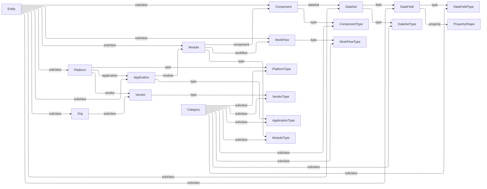

# Schema

```mermaid
%%{init: {"flowchart": {"defaultRenderer": "elk"}} }%%
graph LR
Entity --> |subclass| Platform
Entity --> |subclass| Org
Entity --> |subclass| Application
Entity --> |subclass| Module
Entity --> |subclass| Component
Entity --> |subclass| WorkFlow
Entity --> |subclass| DataSet
Entity --> |subclass| DataField

Category --> |subclass| PlatformType
Category --> |subclass| VendorType
Category --> |subclass| ApplicationType
Category --> |subclass| ModuleType
Category --> |subclass| ComponentType
Category --> |subclass| WorkFlowType
Category --> |subclass| DataSetType
Category --> |subclass| DataFieldType

Org --> |subclass| Vendor

Platform --> |vendor| Vendor
Platform --> |type| PlatformType
Platform --> |application| Application

Vendor --> |type| VendorType

Application --> |type| ApplicationType
Application --> |module| Module

Module --> |type| ModuleType
Module --> |component| Component
Module --> |workflow| WorkFlow

Component --> |type| ComponentType
Component --> |dataSet| DataSet

WorkFlow --> |type| WorkFlowType

DataSet --> |type| DataSetType
DataSet --> |field| DataField

DataField --> |type| DataFieldType
DataField --> |property| PropertyShape
```

