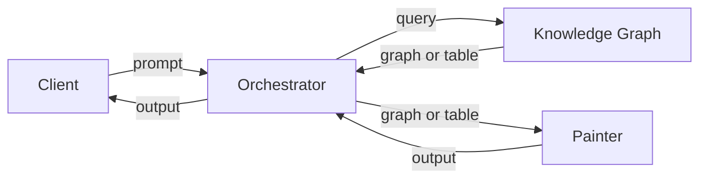

# Coreaa Classes and Interfaces

Here is a set of tables reflecting the primary interfaces, methods, and descriptions based on the provided information.

## Interfaces

### Entity Interface

| **Method**       | **Description**                                                                                                                                 |
|------------------|-------------------------------------------------------------------------------------------------------------------------------------------------|
| **Create**       | This creates a new entity, accepting either RDF, JSON, or XML data structures.                                                                  |
| **UpdateProperty** | For a given entity, this updates a property, closing out the current state of the entry if one exists.                                         |
| **Children**     | Takes the CURIE of the entity and a given property, retrieves all items that point to that resource, defaulting to the `rdf:type` property.       |
| **Properties**   | Retrieves all properties with associated values for a given resource entity.                                                                    |
| **Similar**      | Retrieves a graph of nodes most similar to the given resource entity, based on TF/IDF encoding.                                                 |
| **Schema**       | For a given resource entity, retrieves the schema definition for that entity.                                                                   |
| **Terminate**    | Ends the scope of a given resource entity.                                                                                                      |

### Graph Interface

| **Method**       | **Description**                                                                                                                                 |
|------------------|-------------------------------------------------------------------------------------------------------------------------------------------------|
| **Search**       | Retrieves a graph of nodes (as bookmarks) that most closely match the query or prompt.                                                          |
| **Named Query**  | Retrieves a graph of nodes that satisfy the given named query, passed as a resource.                                                            |
| **Named Graph**  | Retrieves the identifiers associated with all available graphs in the system.                                                                   |
| **Clear**        | Clears a named graph.                                                                                                                           |
| **Move**         | Moves the contents of a defined graph to a different graph.                                                                                     |
| **Copy**         | Copies the contents of a defined graph to a different graph.                                                                                    |
| **Validate**     | Performs a SHACL validation of one graph using a SHACL graph.                                                                                   |

### Presentation Interface

| **Method**       | **Description**                                                                                                                                 |
|------------------|-------------------------------------------------------------------------------------------------------------------------------------------------|
| **Apply**        | Applies the indicated presentation to the associated graph.                                                                                     |

These tables outline the primary interfaces, their methods, and provide brief descriptions for each method.

## Class Descriptions
Here is a set of tables reflecting the relevant classes, their descriptions, and their categorization into operational, conceptual, and foundational classes.

### Operational Classes

| **Class**              | **Description**                                                                                                                                                           |
|------------------------|---------------------------------------------------------------------------------------------------------------------------------------------------------------------------|
| **Entity**             | A base class that contains both core properties and temporal indicators.                                                                                                   |
| **Concept**            | A base class that inherits from Entity, and is used to represent classifications metadata.                                                                                 |
| **Person**             | A given individual, usually modified via roles.                                                                                                                            |
| **Organization**       | A collection of people and resources that work together to accomplish a particular mission. Organizations can contain other organizations. Organization is an abstract class.|
| **Company**            | A for-profit organization.                                                                                                                                                 |
| **Vendor**             | A role for a given company.                                                                                                                                                |
| **Division**           | A semi-autonomous organization within a Company.                                                                                                                           |
| **Department**         | A dependent organization within a division.                                                                                                                                |
| **Platform**           | A self-contained software environment for running applications. This can include operating systems such as Windows or Linux, but it can also include broad-scale SAAS offerings.|
| **Application**        | A piece of software that allows users to interact with the platform (and through that with any associated networks).                                                        |
| **Module**             | A semi-autonomous subcomponent of an application, typically intended to perform specific functions.                                                                         |
| **Service**            | A specific set of APIs that allow for interaction with functionality within a module. Services may be internal to the system or may be conducted across a network.           |
| **Network**            | A vehicle for communication across multiple applications or modules.                                                                                                       |
| **DataStore**          | A particular application that contains representational information (data) and operational access capabilities. This is a generalization of databases.                      |
| **Work**               | A specific work of intellectual property. Note that this is distinct from Employment.                                                                                       |
| **Employment**         | A specific contractual agreement between a company and a person to accomplish specific objectives over a period of time.                                                    |
| **Resource**           | A base class for any commoditizable product. Note that this is distinct from the RDF definition of a resource, which is much more generic.                                  |
| **Annotation**         | A particular note or comment that is bound to a generalized entity in the system through a linkage system.                                                                  |
| **DataSet**            | The representation of a particular set of data, typically as an aggregation of a model or time series. Note that datasets are containers of data, but are not representative of operational classes (though they could be). |
| **Schema**             | A schema is a representation of the structure of a dataset, typically in SHACL.                                                                                            |
| **Project**            | A project is an operational entity that represents the development of a given process. This may be subclassed.                                                              |
| **Address**            | A specific locus on the planet, specified by a set of locational indicators.                                                                                               |
| **Contract**           | A contract typically represents a set of transactions that, when complete, signal the completion (successful or otherwise) of a given project.                              |
| **Named Graph**        | A graph is a specific designation within the data mesh that holds relevant content.                                                                                        |
| **Presentation**       | A presentation is a transformation on either a dataset or a graph of data into a form consumable by either humans or other computer systems.                                 |
| **Template**           | A template is a subcomponent of a presentation used to specify both common structural elements and operational code.                                                        |
| **Social Event**       | A social event is a meeting, conference, class, or related gathering. It is differentiated from the abstract Event class.                                                  |
| **Geopolitical Region**| This is used to indicate a particular contained geo-region, such as a country, state or province, or city. This is an abstract class that is further partitioned into smaller regions. |

### Conceptual and Foundational Classes

| **Class**                | **Description**                                                                                                                                                           |
|--------------------------|---------------------------------------------------------------------------------------------------------------------------------------------------------------------------|
| **Units**                | These identify specific unit definitions and are built to be analogous to the QUDT specification.                                                                          |
| **Coordinate System**    | This is a way of defining a system of reference using a collection of units representing vectors in various ways.                                                           |
| **Biometric Classifications** | This is an abstract class that encapsulates partitioned biometric qualities.                                                                                               |
| **Feature**              | A feature is a way of describing a particular strength or intensity value (as a normalized real number between 0 and 1) of a given abstract concept, such as heat, emotional states, competency, interest, or other poll-like values. |
| **Currency**             | This typically indicates a given unit of currency secured by a given governmental or quasi-governmental entity.                                                              |
| **Others**               | This list can get very large quickly, but it should be understood as a sample, rather than something comprehensive.                                                         |

These tables summarize the operational and conceptual/foundational classes, providing a clear description of each.